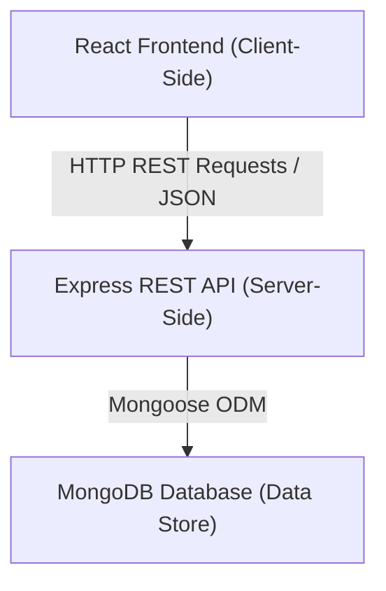
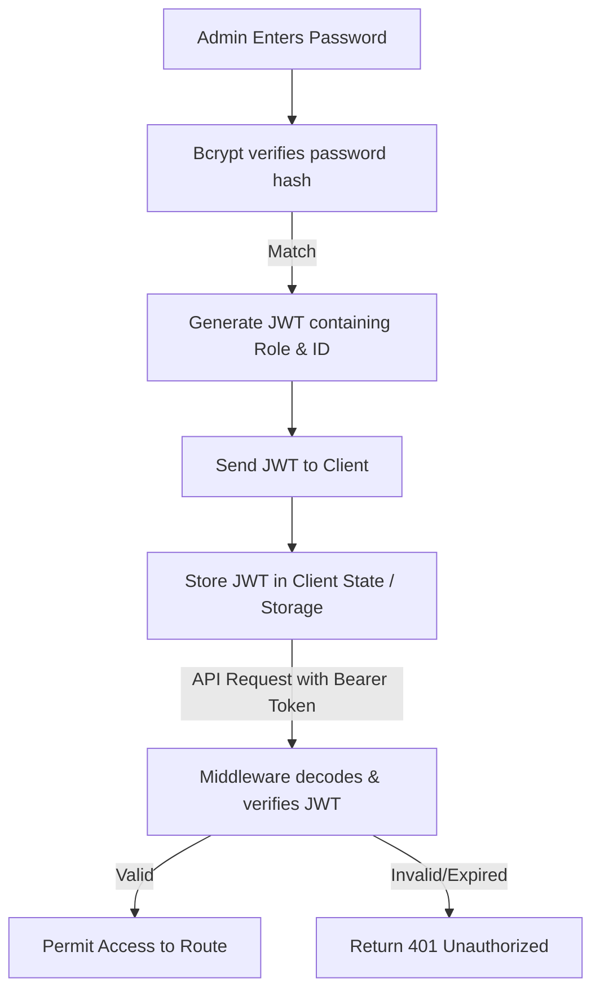

# Dental Clinic Website: Case Study
*A Full-Stack Appointment Scheduling & Clinic Management Web Application*

---

## 1. Project Summary

* **Project Name:** Dental Clinic Website
* **Project Type:** Full-Stack Web Application (SPA)
* **Duration:** 6 Weeks
* **Tech Stack:** React, Vite, Node.js, Express.js, MongoDB, Mongoose, JWT, Bcrypt
* **My Role:** Full-Stack Developer (Designed & developed Frontend, implemented REST APIs, managed Database Schema, and integrated Authentication)

---

## 2. System Architecture

The application is structured as a decoupled client-server architecture:



* **Frontend:** Built with React and Vite to deliver a responsive Single Page Application. It handles routing, UI state, and client-side form validation before dispatching requests.
* **Backend:** Express API server that authenticates routes, processes incoming request body payloads, runs booking validation checks, and updates data states.
* **Database:** MongoDB document store that stores collection resources for admins, patients, and appointment logs.

---

## 3. My Responsibilities

* **Designed and developed the React frontend:** Created modular component views including interactive schedulers, service lists, and admin interfaces.
* **Built REST APIs using Express.js:** Set up routes for user registration, admin login sessions, and appointment scheduling.
* **Connected MongoDB using Mongoose:** Configured schemas, indexes, and connection options.
* **Implemented JWT Authentication:** Set up session tokens for clinic staff to protect admin routes.
* **Developed appointment booking logic:** Created slot check algorithms to ensure time slot availability.
* **Created Admin Dashboard:** Designed the UI panels tracking schedules, patient records, and invoices.
* **Added responsive layouts:** Styled components using custom CSS flexbox and grid layouts for cross-device support.
* **Tested API endpoints:** Tested endpoints using client requests to verify database CRUD operations.

---

## 4. Database Schema & Collections

The MongoDB database contains key collections configured through Mongoose schemas:

* **Admin Users (`admins`):** Stores credentials of clinic staff. Fields include unique `username`, hashed `password`, and custom `role` settings (e.g., admin, doctor, receptionist).
* **Appointments (`appointments`):** Tracks booked slots. Fields include `patientName`, `patientEmail`, `patientPhone`, target `doctor`, chosen `treatment`, date, `timeSlot`, `status` (pending, confirmed, completed, cancelled), and `paymentStatus` (unpaid, paid).
* **Patients:** Simulated entity records generated dynamically from the appointments database to provide a consolidated digital log of patient contacts and visit histories.

---

## 5. API Overview

The REST API exposes the following endpoints:

| Method | Endpoint | Purpose | Access Control |
|:---|:---|:---|:---|
| `POST` | `/api/auth/register` | Register a new clinic administrator | Public |
| `POST` | `/api/auth/login` | Authenticate admin & return JWT session token | Public |
| `POST` | `/api/appointments` | Create a new patient appointment slot | Public |
| `GET` | `/api/appointments` | Retrieve appointments list (filters by date/doctor) | Protected (JWT) |
| `PUT` | `/api/appointments/:id` | Update status, reschedule details, or edit fields | Protected (JWT) |
| `DELETE` | `/api/appointments/:id` | Cancel and remove an appointment record | Protected (JWT) |

---

## 6. Authentication & Security Flow

The system protects sensitive administrative actions and medical data with a secure session lifecycle:



1. **Password Hashing:** Passwords are never stored in plain text. Mongoose pre-save hooks use **Bcrypt** to generate salt iterations and hash passwords before committing them to MongoDB.
2. **Token Generation:** Upon successful login verification, the server generates a JSON Web Token (JWT) signed with a secure server-side key.
3. **Route Protection Middleware:** Administrative endpoints verify incoming authorization headers. If a request lacks a valid, unexpired token, the server returns a `401 Unauthorized` status.

---

## 7. Folder Structure

The project is clean and structured to isolate concerns:

```
Dental Clinic/
├── backend/
│   ├── models/
│   │   ├── Admin.js             # Mongoose Schema for Admin credentials
│   │   └── Appointment.js       # Mongoose Schema for Booking records
│   ├── routes/
│   │   ├── appointments.js      # Appointment API routes & validator checks
│   │   └── auth.js              # Authentication routes (Login/Register)
│   ├── server.js                # Express Server startup file
│   └── seed.js                  # Database seeder utility script
└── frontend/
    ├── src/
    │   ├── components/          # Reusable UI component modules
    │   │   ├── admin/           # Dashboard views (Patients, Schedule)
    │   │   ├── Hero.jsx
    │   │   ├── BookingCalendar.jsx
    │   │   ├── BookingForm.jsx
    │   │   └── Navbar.jsx
    │   └── main.jsx             # React DOM root render
```

---

## 8. Performance Optimizations

* **Client-Side Form Validation:** Validates email strings, phone digit lengths, and empty fields before firing request payloads, reducing server roundtrips.
* **Targeted Database Queries:** Configured database queries to fetch only the required date scope, avoiding heavy collections loads.
* **Error Catch Blocks:** Backend controllers employ try/catch blocks that return precise error codes, preventing server crashes.
* **Responsive Assets:** Compressed visual graphics to reduce page load time.

---

## 9. Deployment Details

* **Frontend:** Configured with Vite build pipelines, compiled static assets ready for hosting on Vercel or Netlify.
* **Backend:** Node/Express API configured to deploy on Render or Heroku.
* **Database:** Connects dynamically via connection strings to MongoDB Atlas cloud instances.
* **Environment Variables Configuration:** System reads credentials dynamically from `.env` files to safeguard private database strings and JWT keys.

---

## 10. Key Challenges & Solutions

### Challenge 1: Preventing Double Booking Conflicts
* *The Problem:* Two users scheduling appointments simultaneously could book the exact same time slot with the same doctor.
* *The Solution:* Created validation checks in the `POST /api/appointments` controller. Before write operations are processed, the system queries the database. If a matching date, doctor, and time slot exists, it returns a conflict error status, prompting the client to choose another time.

### Challenge 2: Mobile Interface Responsiveness for Grid Layouts
* *The Problem:* Standard table calendar components overflowed on small screens, causing horizontal scrolling and usability issues.
* *The Solution:* Rebuilt the slot selector using CSS Flexbox with wrap properties. On mobile viewports, the grid automatically stacks vertically, transforming from a multi-column table into single-column touch buttons.

---

## 11. Future Enhancements

* **SMS & Email Reminders:** Integration with Twilio and Nodemailer to send appointment confirmation codes and 24-hour reminder text notifications.
* **Online Payment Integration:** Adding Stripe or PayPal API checkout gateways to support digital downpayments.
* **Doctor Schedule Portal:** Allowing dentists to log in and set custom shift times, block personal holidays, or mark emergency hours.
* **Patient Prescription Panel:** Expanding patient files to let doctors upload prescriptions and notes directly to a patient's database card.

---

## 12. Key Technical Learnings

* **RESTful API Design:** Gained experience designing status codes, structured JSON payloads, and clean resource routing schemes.
* **JWT-Based Route Protection:** Mastered custom middleware creation to authenticate client requests and manage user session lifecycles.
* **Database Management:** Practiced building relational schemas, using search queries, and avoiding race conditions during write operations.
* **Full-Stack State Synchronization:** Learned to sync database updates with local React state triggers to display live scheduler changes immediately.

---

## 13. Conclusion

The Dental Clinic Website successfully demonstrates how modern full-stack web applications can modernize scheduling systems and streamline business workflows. By integrating a React client interface with a secure Express backend and a robust database layer, the platform reduces scheduling overhead for staff while offering patients a fast, secure, and responsive appointment manager.

