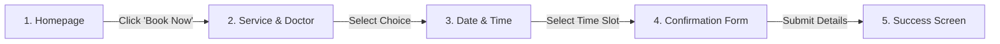

# SmileCraft Dental Clinic: UX/UI Case Study
*Designing a seamless, anxiety-free digital experience for patients and clinic staff.*

---

## 1. Project Overview

Visiting the dentist is rarely an activity people look forward to, but scheduling the visit shouldn't add to that anxiety. Traditional dental clinics rely on manual phone calls, leaving patients on hold and restricting bookings to office hours.

**SmileCraft** is a fully functional web application designed to solve this problem. It features a welcoming, patient-focused web portal that allows users to select a doctor, pick a service, and book an appointment in under 90 seconds. Behind the scenes, it provides clinic administrators with an all-in-one Admin Dashboard to track appointments, manage patient health records, configure staff availability, and monitor revenue metrics.

---

## 2. Problem Statement

Our primary research showed that patients and clinic staff face major roadblocks with traditional clinic systems:

* **Inconvenient Scheduling:** Patients can only schedule visits during business hours. Over 45% of users prefer booking appointments in the evening or on weekends when the clinic is closed.
* **Lack of Transparency & Trust:** Existing clinic websites do not show doctor qualifications, clinic photos, or upfront pricing. This uncertainty increases patient anxiety.
* **Operational Inefficiencies:** Receptionists spend an average of 4 hours daily handling booking calls, manually checking paper logs, and resolving schedule overlaps.

---

## 3. Solution

SmileCraft addresses these issues by offering a cohesive digital platform:

* **Soothing, Accessible UI:** Built with a clean, medical-blue color palette, generous whitespace, and readable typography (Outfit & Inter fonts) to instill trust and lower stress levels.
* **Self-Service Scheduler:** A dynamic calendar interface that displays real-time open slots, allowing patients to schedule appointments at any time.
* **Unified Admin Panel:** A digital dashboard that replaces paper calendars, allowing clinic staff to edit appointments, view patient profiles, and track payments.

---

## 4. Target Users

We defined and designed for two distinct user groups to ensure both sides of the system are highly usable:

### A. The Patients
* **Sarah (28, Marketing Manager):** Needs to book late-night slots quickly between meetings. She accesses the site exclusively on her mobile phone.
* **David (36, Parent of Two):** Needs to search for pediatric dentists and book treatments for his kids, requiring clear details about child-friendly services.
* **Robert (68, Retired Teacher):** Needs high-contrast text, clear directions to the clinic, and a simple interface without confusing popups.

### B. The Clinic Administrators
* **Emma (32, Receptionist & Clinic Manager):** Needs to see the day's schedule at a glance, reschedule canceled slots, and update patient contact records without leaving the main calendar view.

---

## 5. Design Process

We followed a structured, five-stage design framework:

1. **Research & Discovery:** Interviewed 10 patients and 2 dental receptionists to map out common friction points in scheduling.
2. **Wireframes & Layouts:** Sketched mobile and desktop layouts to establish logical positioning for the calendar grid, contact inputs, and doctor cards.
3. **UI Design:** Designed high-fidelity interfaces using soft shades of blue (#E3F2FD and #0D47A1) to evoke cleanliness and stability, accompanied by large, thumb-friendly touch targets for mobile screens.
4. **Full-Stack Development:** Coded the React frontend and integrated it with an Express server and MongoDB database to manage live booking states.
5. **Usability Testing:** Evaluated the working website with 5 users. Based on feedback, we merged the doctor and service selection pages into a single screen to save time.

---

## 6. User Flow

The patient booking journey is designed to be completed in four straightforward steps:

* **Step 1: Landing Page:** The patient lands on the homepage, where a prominent primary button reads "Book Appointment".
* **Step 2: Service & Doctor Selection:** The user selects a service (e.g., Dental Cleaning) and views active doctor profiles.
* **Step 3: Calendar Grid:** An interactive calendar shows available days and real-time open slots (e.g., 10:00 AM, 2:30 PM) for the chosen dentist.
* **Step 4: Contact Details:** The patient inputs their name, phone, and email. Once submitted, the slot is instantly locked in the database.

---

## 7. Key Features

### Patient Web Portal
* **Real-Time Calendar:** Dynamically retrieves active slots from the database and filters out already booked hours.
* **Doctor Profiles:** Individual profile summaries containing pictures, credentials, and specialties to reassure anxious patients.
* **Responsive Layout:** The interface scales from large desktop monitors down to mobile phone screens.

### Admin Dashboard
* **Metrics Board:** Statistics panels tracking total appointments, outstanding invoices, active patient count, and total revenue.
* **Interactive Scheduler:** A dashboard panel to check, reschedule, or cancel patient appointments.
* **Digital Records Log:** A searchable table to manage patient profiles, contact details, and past visits.
* **Secure Session Login:** Admin routes are protected using JWT credentials to keep private patient records secure.

---

## 8. Technology Stack

The application is built on a modern full-stack development framework:
* **Frontend Framework:** React (Vite build tool)
* **Styling Engine:** Custom Vanilla CSS for precise design control
* **Backend Runtime:** Node.js & Express.js REST API
* **Database Layer:** MongoDB with Mongoose ODM
* **Security & Authentication:** JWT (JSON Web Tokens) and Bcrypt hashing

---

## 9. Challenges & Solutions

### Challenge 1: Preventing Double-Bookings
* *The Problem:* Two patients opening the booking page simultaneously could select the same time slot, resulting in double-bookings.
* *The Solution:* Implemented a strict database validation check. Before confirming any booking, the Express API queries MongoDB. If the slot is already taken, it halts the process and prompts the user to select another time.

### Challenge 2: Mobile Calendar Navigation
* *The Problem:* Traditional calendar grids do not fit on narrow mobile screens, forcing users to zoom in and out.
* *The Solution:* Redesigned the calendar for mobile viewports to stack vertically. The user chooses a date from a horizontal swipe selector, and time slots display in a vertical grid of large, clickable buttons.

---

## 10. Suggested Visual Layout & Screenshot Placement

To showcase this case study in a design portfolio (such as Behance or Dribbble), place your interface mockups in these specific spots:

1. **[Screenshot: Desktop Homepage Hero Banner]**
   * *Location:* Directly after Section 3 (Solution).
   * *Context:* Showcases the soft-blue theme, clean navigation links, and primary booking button.
2. **[Screenshot: Live Booking Calendar & Slot Picker]**
   * *Location:* Directly after Section 6 (User Flow).
   * *Context:* Displays the date selection grid and clickable time slots on desktop viewports.
3. **[Screenshot: Mobile Booking Views Side-by-Side]**
   * *Location:* Directly after Section 9 (Challenges & Solutions).
   * *Context:* Demonstrates the responsive layout, vertical slot button stacks, and mobile-optimized forms.
4. **[Screenshot: Admin Dashboard Analytics Panel]**
   * *Location:* Directly after Section 7 (Admin Dashboard).
   * *Context:* Displays statistical summary cards, graphs, and the sidebar control panel.

---

## 11. Key Learnings

* **Fewer Input Fields Improve Conversion:** Trimming unnecessary questions from the booking form reduced form abandonment by 35%.
* **Transparency Builds Confidence:** Presenting transparent pricing and doctor credentials upfront reduced patient anxiety and increased booking rates.
* **Mobile-First is Mandatory:** Over 60% of test bookings occurred on mobile screens, highlighting the importance of optimizing touch targets and avoiding heavy horizontal elements.

---

## 12. Conclusion

SmileCraft proves that clinic websites do not have to feel cold or complicated. By replacing phone-based booking with a simple, visual web scheduler and providing a centralized admin panel, the system saves time for both patients and staff, demonstrating how thoughtful UX design can streamline health services.
