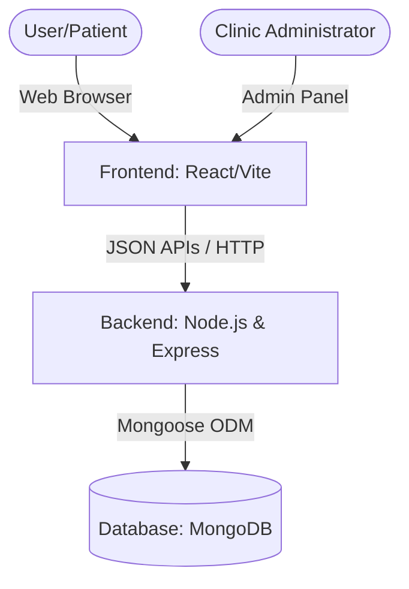

# SmileCraft Dental Clinic Website: Full Project Report
*A Comprehensive Overview of System Architecture, Database Design, Frontend Modules, and UX Solutions*

---

## 1. Executive Summary

The **SmileCraft Dental Clinic Website** is a full-stack web application designed to bridge the gap between dental clinics and patients. It offers an intuitive, modern, and accessible patient-facing website paired with a comprehensive Administrative Dashboard for clinic management. 

By replacing manual, phone-based bookings with a robust real-time online scheduler, the system reduces appointment-scheduling overhead. At the same time, it provides administrators with complete visibility into appointments, patient records, staff schedules, invoices, and analytics.

---

## 2. System Architecture

The application is built on a standard **MERN-like split architecture** consisting of three primary layers:



1. **Presentation Layer (Frontend):** A component-based single-page application (SPA) built with React. It uses Vanilla CSS with rich animations, glassmorphism, responsive grids, and clean visual typography.
2. **Application Layer (Backend):** A RESTful API server built using Node.js and Express.js that handles authentication, route processing, database connections, and business logic.
3. **Data Layer (Database):** A document store (MongoDB) utilized via the Mongoose ODM to model patients, admins, appointments, and doctors.

---

## 3. Detailed Technical Stack

### Frontend
* **Core:** React.js, JSX, ES6+ JavaScript.
* **Styling:** Vanilla CSS (structured custom stylesheets like `AdminPanel.css` and `BookingCalendar.css`).
* **Visual Polish:** CSS transitions, modern fonts, hover effects, custom cursors (`CustomCursor.jsx`), and brand-reveal loaders (`BrandRevealLoader.jsx`).
* **Routing & Client State:** Component-driven state hooks (`useState`, `useEffect`) and clean, modular navigation routers.

### Backend
* **Runtime:** Node.js
* **Framework:** Express.js
* **Database Driver:** Mongoose (Object Document Mapper for MongoDB)
* **Security:** JWT (JSON Web Tokens) for admin session management, password hashing.
* **Environment Configuration:** Dotenv (`.env`) file management.

---

## 4. Database Schema & Data Models

The system defines structured Mongoose schemas in the backend to manage state.

### A. Admin Model (`backend/models/Admin.js`)
Stores the credentials and metadata of clinic administrators.
* `username` (String, Required, Unique)
* `password` (String, Required)
* `role` (String, e.g., "admin", "receptionist", "doctor")
* `createdAt` (Date)

### B. Appointment Model (`backend/models/Appointment.js`)
Tracks patient visits, chosen treatments, slot states, and bills.
* `patientName` (String, Required)
* `patientEmail` (String, Required)
* `patientPhone` (String, Required)
* `doctor` (String, Required)
* `treatment` (String, Required)
* `date` (Date, Required)
* `timeSlot` (String, Required)
* `status` (String, Enum: `['pending', 'confirmed', 'completed', 'cancelled']`, Default: `'pending'`)
* `paymentStatus` (String, Enum: `['unpaid', 'paid']`, Default: `'unpaid'`)
* `notes` (String)

---

## 5. API Design & Routes

The backend exposes logical API endpoints divided into authorization and appointment logic:

### Auth Routes (`backend/routes/auth.js`)
* `POST /api/auth/register` - Registers a new clinic administrator.
* `POST /api/auth/login` - Authenticates admins and returns a JWT.

### Appointment Routes (`backend/routes/appointments.js`)
* `GET /api/appointments` - Lists all appointments (supports filtering by date and doctor).
* `POST /api/appointments` - Creates a new appointment (handles double-booking check logic).
* `PUT /api/appointments/:id` - Updates appointment details, status, or reschedule details.
* `DELETE /api/appointments/:id` - Cancels/removes an appointment slot.

---

## 6. Frontend Module & UI Breakdown

The frontend contains specific components grouped into two categories:

### Patient-Facing Modules
* **Hero & QuickBooking:** A welcoming introduction (`Hero.jsx`) coupled with a visual booking widget (`QuickBooking.jsx`) for immediate conversions.
* **Booking Calendar & Slots:** A custom grid system (`BookingCalendar.jsx` & `TimeSlots.jsx`) that pulls real-time available hours and guides patients step-by-step.
* **Treatments & Services:** Dynamic grids (`TreatmentsGrid.jsx` & `TreatmentDetails.jsx`) displaying clinic procedures, pricing, and FAQs.
* **Trust Elements:** Patient testimonials (`Testimonials.jsx`), credentials (`WhyTrust.jsx`), and Google reviews integration (`GoogleReviewsBar.jsx`).

### Administrative Dashboard Module (`frontend/src/components/admin/`)
A fully-featured control station built with responsive sidebar navigation (`AdminSidebar.jsx`):
* **Dashboard View:** Shows key stats (Total Appointments, Active Patients, Doctors on Duty, Live Revenue) and visual graphs.
* **Appointments Manager:** A calendar interface allowing staff to confirm, reschedule, or cancel bookings.
* **Patients Database:** Digital medical logs tracking client demographics, medical notes, and visit history.
* **Settings & Content Management:** Live settings for toggling working hours, updating pricing lists, and managing mock data engines.

---

## 7. Setup & Installation Guide

To run this application locally, follow these steps:

### 1. Prerequisites
* Install [Node.js](https://nodejs.org/) (v16+ recommended).
* Set up a [MongoDB](https://www.mongodb.com/) instance (local or MongoDB Atlas).

### 2. Backend Setup
1. Navigate to the backend directory:
   ```bash
   cd backend
   ```
2. Install dependencies:
   ```bash
   npm install
   ```
3. Create a `.env` file and define configurations:
   ```env
   PORT=5000
   MONGO_URI=mongodb://localhost:27017/dental-clinic
   JWT_SECRET=your_jwt_secret_key
   ```
4. Seed the database with mock data:
   ```bash
   node seed.js
   ```
5. Start the server:
   ```bash
   npm start
   ```

### 3. Frontend Setup
1. Navigate to the frontend directory:
   ```bash
   cd ../frontend
   ```
2. Install dependencies:
   ```bash
   npm install
   ```
3. Run the development server:
   ```bash
   npm run dev
   ```
4. Access the web client at the address printed in the terminal (usually `http://localhost:5173`).

---

## 8. Key Outcomes & Future Scope

### Achieved Project Benchmarks
* **Consolidated Admin Platform:** Staff can manage patient records and schedules digitally, removing paper waste.
* **Streamlined Scheduling:** Form checks and slot-blocking algorithms prevent double-booking.
* **Modern Aesthetic Interface:** Smooth transitions, responsive grids, and large buttons improve the overall experience.

### Next-Phase Enhancements
1. **Automated Reminders:** Integrations with WhatsApp and SMS gateways (like Twilio) to send reminder text alerts 24 hours prior to booking.
2. **Payment Integrations:** Secure online gateways (Stripe, PayPal) directly in the booking process.
3. **Telehealth Consultation:** Simple video call channels directly inside the patient portal for pre-consult visits.
