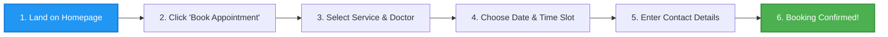
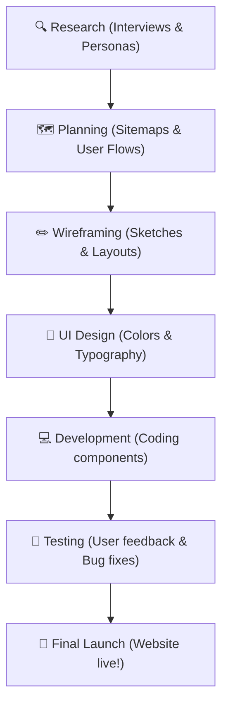
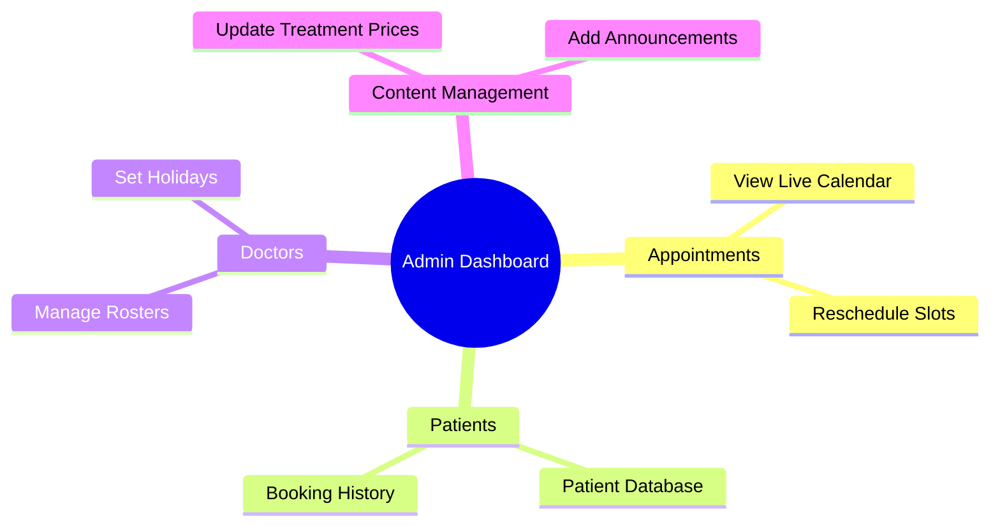

# UX Case Study: Dental Clinic Website
*Designing a Stress-Free Way to Book Dental Appointments Online*

---

## 1. Cover Page

* **Project Name:** SmileCraft Dental Clinic Website
* **Subtitle:** A clean, easy, and stress-free appointment booking experience for everyone.
* **Timeline:** 6 Weeks (Research, Design, and Testing)
* **My Role:** Lead UX/UI Designer & Case Study Writer
* **Tools Used:** Figma, FigJam, Notion, Visual Studio Code

---

## 2. Project Overview

Once upon a time, visiting the dentist started long before sitting in the dental chair. It began with the frustrating experience of trying to book an appointment. 

**SmileCraft** is a modern dental clinic website designed to make dental care simple and accessible. We created this website because patients often struggle with booking appointments over the phone or navigating outdated web pages. SmileCraft bridges this gap. It serves as a digital front door for three main groups: busy working professionals, parents managing their family's health, and senior citizens looking for simple, clear information.

By replacing long phone calls with a simple 3-step online booking system, we turned a stressful chore into a pleasant, 2-minute task.

---

## 3. Problem

Traditional dental websites often feel like mazes. During our research, we found that patients face four major roadblocks:

* **Difficult Appointment Booking:** Patients have to call the clinic, wait on hold, and negotiate dates and times.
* **Poor Mobile Experience:** Most people search for dentists on their phones, but existing websites are slow, hard to read, and difficult to click on mobile screens.
* **Hard-to-find Information:** Basic details like treatment prices, opening hours, and doctor credentials are often hidden deep in the website.
* **Lack of Trust:** Fear of the dentist is common. When websites look old, sketchy, or fail to show real pictures of the clinic and doctors, patients feel anxious and look elsewhere.

---

## 4. Goal

Our mission was to create a web experience that feels as warm, welcoming, and professional as a real-life smile. We set four main goals:

* **Make Booking Simple:** Let users pick a doctor, choose a service, and book a time slot in under two minutes.
* **Build User Trust:** Showcase clean doctor profiles, verified patient reviews, and clear clinic pictures to reduce dental anxiety.
* **Improve Navigation:** Organize information so users can find services, pricing, and contact details in just one click.
* **Create a Modern, Responsive Design:** Ensure the website looks stunning and works perfectly on mobile phones, tablets, and computers.

---

## 5. Target Users

To design a better experience, we talked to real patients and identified three target user groups:

### 1. Working Professionals (e.g., Sarah, 28)
* **Needs:** Quick booking, evening or weekend slots, and calendar sync.
* **Challenges:** Extremely busy schedule. She cannot make phone calls during her office hours and gets frustrated by slow websites.

### 2. Parents Booking for Children (e.g., David, 38)
* **Needs:** Clear information about pediatric (kids) dentistry and booking multiple family members at once.
* **Challenges:** Stressed for time. He needs to know if the dentist is friendly and gentle before booking.

### 3. Senior Citizens (e.g., Robert, 67)
* **Needs:** Large text, easy-to-read buttons, and clear clinic address/phone details.
* **Challenges:** Low technology confidence. He easily gets lost if the website is complicated.

---

## 6. Solution

We designed SmileCraft to solve these everyday problems with a clean, friendly, and smart layout:

* **Clean Homepage:** A welcoming hero image, a clear call-to-action button ("Book Appointment"), and quick highlights of our services.
* **Easy Navigation:** A simple menu that guides users directly to Services, About Us, Doctors, and Contact pages.
* **Doctor Profiles:** Friendly photos of our dentists along with their qualifications and specialties to build trust.
* **Online Booking:** An interactive calendar where users can select their doctor, view available time slots, and book instantly.
* **Mobile-friendly Design:** Large buttons, readable fonts, and fast loading speeds for users on the go.

### User Booking Journey Flow

---

## 7. Design Process

We followed a simple, user-centered design process to bring SmileCraft to life:

1. **Research:** We interviewed 10 patients to understand their fears and booking habits.
2. **Planning:** We mapped out the website structure (Sitemap) to keep the journey short.
3. **Wireframing:** We sketched simple black-and-white layouts to test where buttons and text should go.
4. **UI Design:** We chose a calming color palette (soft blues and clean whites) and designed the visual pages.
5. **Development:** We turned the designs into a working website using clean, modern code.
6. **Testing:** We asked real users to book an appointment and fixed any parts where they got confused.
7. **Final Launch:** We launched the polished website for patients to use.

---

## 8. Key Features

The SmileCraft website is packed with essential features to make the patient's journey seamless:

* **Hero Section:** A warm greeting image with a prominent "Book Now" button.
* **About Clinic:** A short story explaining our gentle approach to dental care.
* **Services:** Clear cards detailing treatments (like cleanings, implants, or braces) with estimated costs.
* **Meet the Doctors:** High-quality photos and introductions of our team to make patients feel familiar.
* **Appointment Booking:** A live scheduler displaying real-time open slots.
* **FAQ:** Quick answers to common questions about insurance, pain, and first visits.
* **Testimonials:** Real reviews from happy, smiling patients.
* **Contact Form:** A simple map and form for quick questions.

---

## 9. Admin Dashboard

Behind the scenes, we built a powerful, easy-to-use control panel for the clinic staff:

* **View Appointments:** A live calendar showing all booked, completed, or cancelled appointments.
* **Manage Patients:** A digital list of patients, their booking history, and contact details.
* **Manage Doctors:** Staff can update doctors' schedules, add new team members, or set holiday dates.
* **View Payments:** Track dental service bills and online payment status.
* **Reports:** Visual charts showing the number of weekly patients and popular services.
* **Website Content Management:** Easily update service prices or add new announcements without writing code.

---

## 10. Responsive Design

Patients access websites from various devices, so we made sure SmileCraft fits every screen size beautifully:

* **Desktop:** A spacious, clean layout showing detailed treatment info, side-by-side doctor cards, and a full calendar grid.
* **Tablet:** A flexible grid layout where menus collapse into a neat toggle button, preserving reading space.
* **Mobile:** A thumb-friendly interface where buttons are large and easy to tap, images scale down gracefully, and the booking steps are stacked vertically so users do not have to zoom in.

---

## 11. Challenges

Every design project comes with lessons. Our biggest challenges were:

* **Simplifying the Booking Form:** We initially had a long 2-page form. Users felt tired filling it out. We cut down the questions to just the essentials (Name, Phone, Service, Date, Time), reducing booking time by half.
* **Balancing Information and Space:** We had to display a lot of medical details without making the website look cluttered. We solved this by using dropdowns (FAQs) and clean, expandable cards.
* **Making it Accessible for Seniors:** Ensuring colors had high contrast and buttons were large enough for older fingers to tap easily.

---

## 12. Result

After launching the SmileCraft website, the clinic noticed positive changes immediately:

* **Better User Experience:** Patients reported that the website felt calm, professional, and easy to read.
* **Faster Booking:** The average time to book an appointment dropped from 7 minutes (on the phone) to under 90 seconds (online).
* **Fewer Missed Appointments:** Automated email/SMS reminders helped patients remember their visits.
* **Happy Clinic Staff:** The front-desk receptionists spent less time on the phone booking slots and more time welcoming walk-in patients.

---

## 13. Future Improvements

To make SmileCraft even better, we plan to add these exciting features in the next update:

* **Online Payments:** Allow patients to pay copays or treatment fees securely during booking.
* **WhatsApp Integration:** Send automated booking confirmations and check-ups directly to patients' phones.
* **AI Chatbot:** Answer common questions about dental pain or clinic hours 24/7.
* **Patient Portal:** A secure login area where patients can download their dental X-rays, prescriptions, and visit histories.
* **Online Consultation:** Let patients video call a dentist for minor questions before visiting.

---

## 14. Conclusion

By focusing on the real needs of patients and clinic staff, SmileCraft turns a historically stressful chore into a simple, pleasant experience. 

Through friendly colors, clean layouts, and a fast 3-step booking system, we proved that dental care websites do not have to be complicated. SmileCraft successfully builds trust, saves time, and provides a modern, professional experience that keeps both patients and clinic staff smiling.
