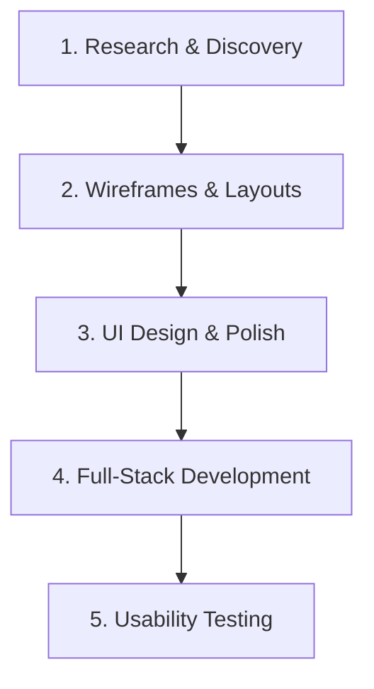
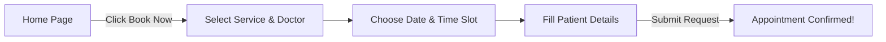

# SmileCraft Dental Clinic: UX/UI Case Study
*Designing a seamless, anxiety-free digital experience for patients and clinic staff.*

---

## 1. Project Overview

Visiting the dentist can be stressful. Unfortunately, booking an appointment often adds to that stress with busy phone lines, confusing clinic websites, and lack of clear info. 

**SmileCraft** is a modern, responsive web application built to change this. It provides a warm, welcoming website where patients can book dental appointments in under two minutes, and gives clinic staff a unified Admin Dashboard to manage schedules, patients, and billing records efficiently.

---

## 2. Problem Statement

Most dental clinic websites are outdated, cluttered, and difficult to navigate on mobile devices. Patients face three main pain points:
* **Booking Hurdles:** Having to call during clinic hours to find open slots.
* **Lack of Trust:** Hidden pricing, missing doctor profiles, and clinical, clinical-looking interfaces that increase dental anxiety.
* **Staff Overload:** Receptionists spending too much time answering phones, resolving scheduling conflicts, and updating paper files.

---

## 3. Solution

SmileCraft bridges the gap with a clean, patient-centric design system and a backend scheduling system:
* **3-Step Scheduler:** A calendar grid showing real-time open slots, letting patients book instantly without calling.
* **Empathetic Interface:** Calming blue and white color palettes, friendly team profiles, and transparent service details to build trust.
* **All-in-One Dashboard:** A single portal for staff to view calendars, update medical histories, and process invoices.

---

## 4. Target Users

We designed the application for two distinct user groups:

### A. The Patients
* **Who they are:** Busy professionals, parents booking for kids, and senior citizens.
* **Their Needs:** Quick mobile scheduling, easy treatment exploration, and clear instructions on how to reach the clinic.

### B. The Clinic Administrators
* **Who they are:** Receptionists, clinic managers, and dentists.
* **Their Needs:** An overview of the day's schedule, an digital repository for patient health files, and a simple way to adjust time slots.

---

## 5. Design Process

We followed a user-centric design process to bring the solution to life:

1. **Research:** Surveyed patients to identify pain points with traditional booking channels.
2. **Wireframes:** Sketched low-fidelity layouts to test button placement, spacing, and navigation paths.
3. **UI Design:** Selected a soft blue palette, typography, and designed clean cards for services and doctors.
4. **Development:** Built a fast-loading single-page application using React, Node.js, and MongoDB.
5. **Testing:** Conducted user test tasks with parents and senior citizens to refine the calendar interface.

---

## 6. User Flow

The patient's journey is optimized for speed and simplicity:

* **Step 1:** The user lands on the welcoming homepage and taps the primary **"Book Appointment"** button.
* **Step 2:** They select their desired treatment (e.g., Cleaning, Root Canal) and choose a dentist.
* **Step 3:** The app displays an interactive calendar showing only available slots.
* **Step 4:** The user fills in their contact information and clicks submit. The system instantly reserves the slot.

---

## 7. Key Features

### Patient Experience
* **Online Booking:** A 3-step scheduler accessible directly from the homepage.
* **Doctor Selection:** Detailed cards displaying credentials, specialties, and pictures of our dentists.
* **Calendar & Slot Picker:** Real-time calendars filtering out booked dates to prevent scheduling conflicts.
* **Patient Form:** A minimal form asking only for vital details (Name, Contact, Treatment).

### Admin Experience
* **Dashboard Stats:** Quick metrics showing daily visits, earnings, and active patients.
* **Appointment Management:** Live calendar interface to approve, reschedule, or cancel bookings.
* **Patient Records:** Digital database storing patient details, visit history, and invoice status.
* **Secure Login:** Encrypted login system protecting sensitive patient information.

---

## 8. Technology Stack

* **Frontend:** React, Vite, Vanilla CSS
* **Backend:** Node.js, Express.js
* **Database:** MongoDB, Mongoose
* **Security:** JWT Authentication, Bcrypt Password Hashing

---

## 9. Challenges & Solutions

### Challenge 1: Double-Booking Conflicts
* *The Problem:* Multiple users trying to book the exact same slot at the same time.
* *The Solution:* Created a backend check inside the Express route that locks a slot when a user enters the form and validates availability before writing it to MongoDB.

### Challenge 2: Senior Citizen Accessibility
* *The Problem:* Older patients found small calendar slots hard to read and tap.
* *The Solution:* Enlarged buttons, set font sizes to high-contrast scales, and limited the calendar to a simple grid layout with distinct colors for available vs. taken slots.

---

## 10. Suggested Visual Layout (Where to place screenshots)

When publishing this case study to Dribbble, Behance, or a portfolio site, place high-quality mockups at the following highlights:

1. **[SCREENSHOT PLACEHOLDER: HOMEPAGE MOCKUP]**
   * *Where:* Under Section 1 & 3.
   * *What to show:* The desktop hero image showcasing the welcoming dental clinic banner and the clear call-to-action button.
2. **[SCREENSHOT PLACEHOLDER: APPOINTMENT SCHEDULER & CALENDAR]**
   * *Where:* Under Section 6 & 7.
   * *What to show:* The clean 3-step booking flow showing the interactive calendar grid and active slots.
3. **[SCREENSHOT PLACEHOLDER: MOBILE VIEW COMPANION]**
   * *Where:* Under Section 7.
   * *What to show:* A side-by-side view showing how the booking page stacks elements for easy thumb usage on mobile screens.
4. **[SCREENSHOT PLACEHOLDER: ADMIN DASHBOARD OVERVIEW]**
   * *Where:* Under Section 7 (Admin Experience).
   * *What to show:* The backend control panel displaying statistics cards and charts.
5. **[SCREENSHOT PLACEHOLDER: PATIENT MEDICAL RECORDS LOG]**
   * *Where:* Under Section 7 (Admin Experience).
   * *What to show:* The clean tabular layout displaying contact search grids and medical histories.

---

## 11. Key Learnings

* **Less is More in Forms:** Reducing input fields in the booking form from 8 down to 4 significantly reduced form abandonment.
* **Visual Trust Matters:** Patients feel much less anxious when they can see high-quality photos of the doctors and clinic before booking.
* **Feedback Loops are Critical:** Testing with real-world users revealed navigation issues that coding tests could never find.

---

## 12. Conclusion

SmileCraft shows that medical websites don't have to feel cold and complicated. By combining a soothing visual aesthetic with a quick, intuitive booking process and a simplified admin panel, we created a tool that saves time for both patients and staff, transforming the way clinic operations are managed.
